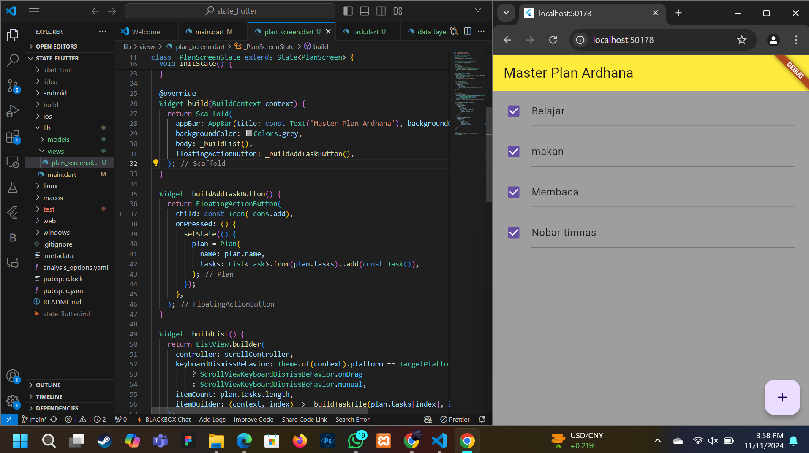

# NAMA: ARDHANA PRASASTA
# NIM: 362358302081
# KELAS: 2B TRPL

1. 

2. 1. Maksud dari Langkah 4 pada Praktikum
Pada Langkah 4, kita membuat file data_layer.dart di folder models yang berfungsi sebagai titik ekspor untuk plan.dart dan task.dart. Di dalam file ini, kita menambahkan kode berikut:

Tujuan dari langkah ini adalah untuk menyederhanakan proses impor model dalam file lain. Dengan menggunakan file data_layer.dart, kita cukup mengimpor data_layer.dart daripada harus mengimpor plan.dart dan task.dart secara terpisah di setiap file yang membutuhkan model tersebut. Ini juga membuat struktur proyek menjadi lebih rapi dan terorganisir.

2. Mengapa Variabel plan Diperlukan di Langkah 6 dan Mengapa Dibuat Konstanta?
Pada Langkah 6, variabel plan dideklarasikan sebagai berikut:

Variabel plan diperlukan karena berfungsi sebagai data utama yang berisi daftar Task. Daftar ini adalah data yang akan ditampilkan, dimanipulasi, dan diubah di seluruh aplikasi.

Variabel plan didefinisikan sebagai konstanta dengan kata kunci const karena pada saat inisialisasi awal, Plan tidak memerlukan perubahan dan nilainya tetap, sehingga dapat diinisialisasi sebagai konstanta. Menjadikannya const juga mengoptimalkan performa dan efisiensi memori karena konstanta disimpan pada saat kompilasi dan tidak perlu dibuat ulang setiap kali widget dirender ulang.

3. Capture dan Penjelasan Hasil dari Langkah 9
Langkah 9 membuat widget _buildTaskTile, yang menampilkan setiap Task dalam bentuk ListTile dengan Checkbox dan TextFormField untuk mendeskripsikan tugas.

Hasil dari Langkah 9 adalah setiap Task muncul dalam daftar tugas, dan setiap tugas memiliki:

Checkbox untuk menandai apakah tugas sudah selesai.
TextFormField untuk mengubah deskripsi tugas secara langsung.
Setiap perubahan pada checkbox atau teks otomatis memperbarui daftar tugas (plan.tasks) dan menyimpan perubahan dalam variabel plan.

Penjelasan capture dalam bentuk GIF: GIF yang Anda buat harus menampilkan daftar tugas yang diisi secara dinamis. Anda bisa menunjukkan bagaimana menambah tugas baru dengan menekan tombol tambah (FloatingActionButton) dan memperlihatkan pembaruan pada deskripsi atau status lengkap tiap tugas.

4. Kegunaan Method pada Langkah 11 dan 13 dalam Lifecycle State
Langkah 11: Pada langkah ini, kita menambahkan Scroll Listener di method initState():

Method ini adalah bagian dari lifecycle state widget di Flutter, dan digunakan untuk menginisialisasi objek atau pengaturan saat widget pertama kali dibuat. initState() hanya dipanggil sekali, sehingga merupakan tempat yang ideal untuk menginisialisasi scrollController dan Scroll Listener. Listener ini akan menghilangkan fokus dari semua TextField selama scroll, memungkinkan keyboard untuk menutup secara otomatis saat scroll dilakukan.

Langkah 13: Method dispose():

Method dispose() adalah bagian dari lifecycle state untuk membersihkan dan menghapus objek saat widget dihapus atau tidak digunakan lagi. Di sini, dispose() digunakan untuk menghapus scrollController dari memori agar tidak terjadi kebocoran memori ketika widget tidak digunakan lagi.
